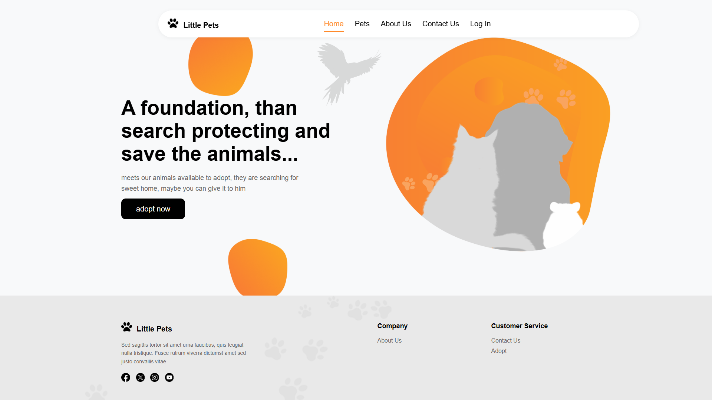
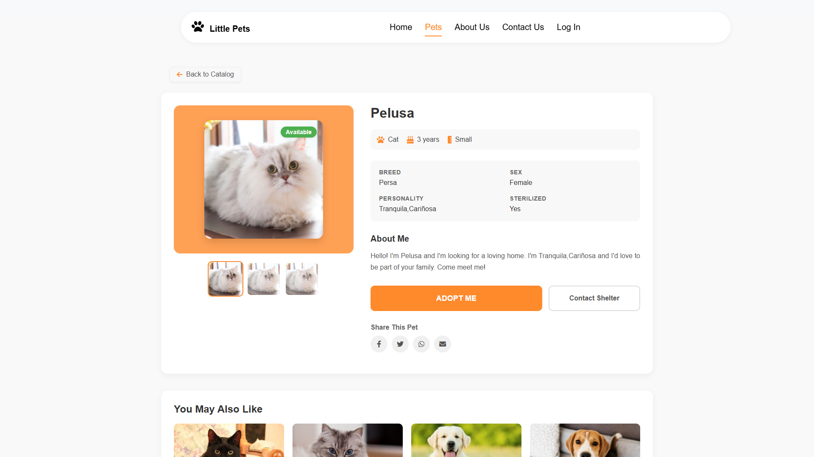
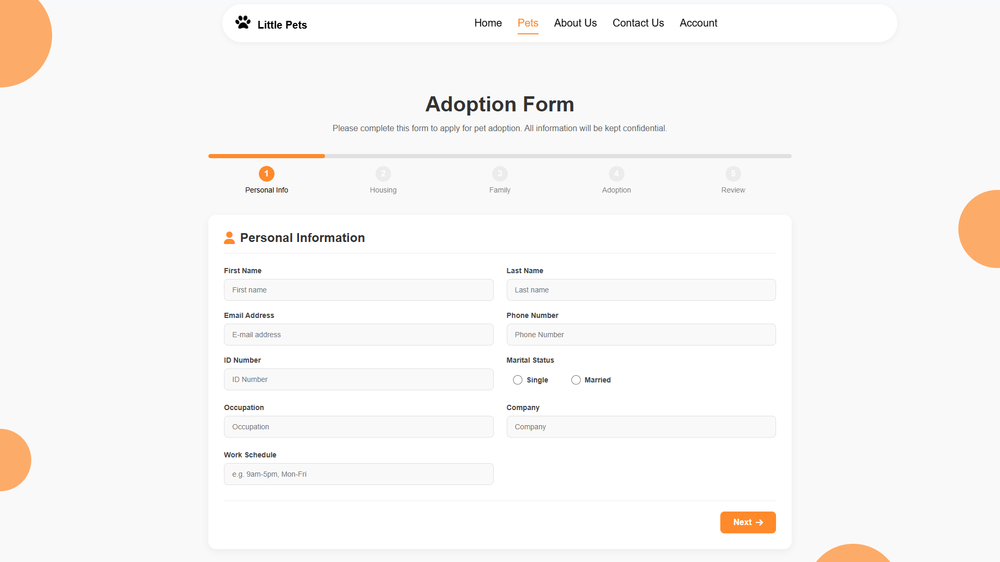

# Little Pets 🐾

Little Pets es una aplicación web completa para una fundación de adopción de mascotas, diseñada para conectar animales que necesitan un hogar con personas dispuestas a adoptar.

## 🌐 Demo

Visita la aplicación en vivo: [https://little-pets.onrender.com](https://little-pets.onrender.com)

## 📋 Características

### Gestión de Mascotas
- **Catálogo de mascotas**: Explora perros y gatos disponibles para adopción
- **Perfiles detallados**: Información completa sobre cada mascota (edad, raza, personalidad, etc.)
- **Gestión de imágenes**: Soporte para múltiples imágenes por mascota (hasta 3)
- **Estados de disponibilidad**: Available, Adopted, Fostered, Pending

### Sistema de Adopción
- **Proceso de adopción**: Formulario paso a paso con generación de PDF
- **Gestión de solicitudes**: Panel de control para aprobar/rechazar solicitudes
- **Notificaciones por correo**: Emails personalizados con el nombre de la mascota
- **Seguimiento de estado**: Monitoreo del estado de las solicitudes

### Usuarios y Seguridad
- **Sistema de usuarios**: Registro, inicio de sesión y perfiles de usuario
- **Roles y permisos**: Diferentes niveles de acceso (usuario, manager, administrador)
- **Logout seguro**: Confirmación de cierre de sesión con notificaciones
- **Validación de datos**: Verificación de cédula y email únicos

### Interfaz y Experiencia de Usuario
- **Diseño responsivo**: Adaptable a dispositivos móviles y de escritorio
- **Notificaciones Toastify**: Feedback visual para acciones del usuario
- **Formulario de contacto**: Comunicación directa con la fundación
- **Navegación intuitiva**: Menú hamburguesa para dispositivos móviles

## 🛠️ Tecnologías

### Backend
- **Node.js** y **Express**: Framework para la API RESTful
- **MongoDB** y **Mongoose**: Base de datos NoSQL y ODM
- **JWT**: Autenticación basada en tokens
- **bcrypt**: Encriptación segura de contraseñas
- **SendGrid**: Envío de correos electrónicos personalizados
- **Cloudinary**: Almacenamiento y gestión de imágenes y PDFs

### Frontend
- **HTML5**, **CSS3** y **JavaScript** (vanilla)
- **Toastify**: Notificaciones elegantes
- **SweetAlert2**: Diálogos de confirmación mejorados
- **jsPDF**: Generación de documentos PDF para solicitudes de adopción

## 🚀 Instalación

1. Clona este repositorio:
```bash
git clone https://github.com/JhonatanM2005/little-pets.git
cd little-pets
```

2. Instala las dependencias:
```bash
npm install
```

3. Crea un archivo `.env` en la raíz del proyecto con las siguientes variables:
```
CONNECTION_STRING=tu_cadena_de_conexion_mongodb
JWT_SECRET=tu_clave_secreta_jwt
SENDGRID_API_KEY=tu_api_key_sendgrid
FROM_EMAIL=email_remitente@ejemplo.com
TO_EMAIL=email_destino@ejemplo.com
CLOUDINARY_CLOUD_NAME=tu_cloud_name
CLOUDINARY_API_KEY=tu_api_key
CLOUDINARY_API_SECRET=tu_api_secret
```

4. Inicia el servidor de desarrollo:
```bash
npm run dev
```

5. Accede a la aplicación en `http://localhost:3000`

## 📁 Estructura del Proyecto

```
little-pets/
├── public/               # Archivos estáticos
│   ├── css/              # Hojas de estilo
│   ├── js/               # Scripts del cliente
│   ├── media/            # Imágenes y recursos multimedia
│   └── pages/            # Páginas HTML
├── src/                  # Código del servidor
│   ├── config/           # Configuraciones (DB, Cloudinary)
│   ├── controllers/      # Controladores
│   ├── middlewares/      # Middlewares (auth, roles)
│   ├── models/           # Modelos de datos
│   ├── services/         # Servicios (email, storage)
│   └── routes/           # Rutas de la API
├── .env                  # Variables de entorno (no incluido en git)
├── .gitignore            # Archivos ignorados por git
├── package.json          # Dependencias y scripts
└── README.md             # Este archivo
```

## 🔒 API Endpoints

### Autenticación
- `POST /api/auth/register`: Registro de usuario
- `POST /api/auth/login`: Inicio de sesión

### Usuarios
- `GET /api/users/profile`: Obtener perfil del usuario autenticado
- `GET /api/users`: Obtener lista de usuarios (admin)
- `PUT /api/users/:id`: Actualizar usuario (admin)
- `DELETE /api/users/:id`: Eliminar usuario (admin)

### Mascotas
- `GET /api/pets`: Obtener todas las mascotas
- `GET /api/pets/:id`: Obtener una mascota por ID
- `POST /api/pets`: Crear una nueva mascota (admin/manager)
- `PUT /api/pets/:id`: Actualizar una mascota (admin/manager)
- `DELETE /api/pets/:id`: Eliminar una mascota (admin/manager)

### Adopciones
- `POST /api/adoptions`: Crear solicitud de adopción
- `GET /api/adoptions`: Listar solicitudes (admin/manager)
- `PUT /api/adoptions/:id/status`: Actualizar estado de solicitud
- `GET /api/adoptions/:id/pdf`: Obtener PDF de solicitud

### Contacto
- `POST /api/contact`: Enviar mensaje de contacto

## 👥 Roles de Usuario

- **Usuario**: 
  - Ver catálogo de mascotas
  - Enviar solicitudes de adopción
  - Gestionar su perfil
  - Enviar mensajes de contacto

- **Manager**: 
  - Todo lo del usuario normal
  - Gestionar mascotas (CRUD)
  - Aprobar/rechazar solicitudes
  - Ver estadísticas básicas

- **Administrador**: 
  - Todo lo del manager
  - Gestión completa de usuarios
  - Acceso a todas las estadísticas
  - Configuración del sistema

## 📱 Capturas de Pantalla





## 🤝 Contribuir

1. Haz un fork del proyecto
2. Crea una rama para tu característica (`git checkout -b feature/amazing-feature`)
3. Haz commit de tus cambios (`git commit -m 'Add some amazing feature'`)
4. Haz push a la rama (`git push origin feature/amazing-feature`)
5. Abre un Pull Request

## 👨‍💻 Equipo de Desarrollo

Este proyecto fue desarrollado por **CharlieYLaFabricaDelCodigo**.

## 📄 Licencia

Este proyecto está bajo la Licencia MIT - ver el archivo [LICENSE](LICENSE) para más detalles.

## 📧 Contacto

CharlieYLaFabricaDelCodigo - [charlieylafabricadelcodigo@gmail.com](mailto:charlieylafabricadelcodigo@gmail.com)
